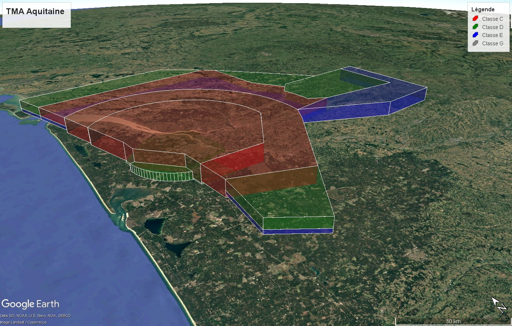

# python-eaiptokml
Extract airspaces from eAIP France and export then as KML files

# Google Earth KMZ

File is available here [airspaces_global.kmz](https://github.com/nefethael/python-eaiptokml/raw/refs/heads/main/extracts/airspaces_global.kmz)

Note generation is from AIRAC-2025-08-07.

Note KMZ can only be opened in Google Earth Pro desktop application.

# How to generate

Generation is done in three steps:

1. `download_all.sh` downloads every pages from eAIP locally and do some basic filtering
2. `generate_json_from_eaip.py` parses every html tables to retrieve zone informations saved into JSON

    - Identification
    - Lateral limits
	- Class
	- Vertical limits

3. `generate_kml_from_json.py` uses JSON to generate proper KML/KMZ files
	
	
`launch.sh` script calls every subprograms to perform all steps at once.

# Example 

# Video Presentation

